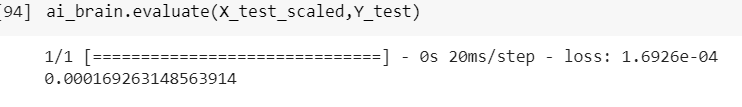

# Developing a Neural Network Regression Model

## AIM

To develop a neural network regression model for the given dataset.

## THEORY

Here we took a problem and trained the machine to predict the output for the given dataset. 

## Neural Network Model


## DESIGN STEPS

### STEP 1:

Loading the dataset

### STEP 2:

Split the dataset into training and testing

### STEP 3:

Create MinMaxScalar objects ,fit the model and transform the data.

### STEP 4:

Build the Neural Network Model and compile the model.

### STEP 5:

Train the model with the training data.

### STEP 6:

Plot the performance plot

### STEP 7:

Evaluate the model with the testing data.

## PROGRAM
```
from google.colab import auth
import gspread
from google.auth import default
import pandas as pd

auth.authenticate_user()
creds, _ = default()
gc = gspread.authorize(creds)

from sklearn.model_selection import train_test_split
from sklearn.preprocessing import MinMaxScaler
from tensorflow.keras.models import Sequential
from tensorflow.keras.layers import Dense

import tensorflow as tf

worksheet = gc.open('My First Dataset').sheet1

rows = worksheet.get_all_values()

df = pd.DataFrame(rows[1:], columns=rows[0])

df.head(n=30)

df.dtypes

df=df.astype({'X':'float'})
df=df.astype({'Y':'float'})

df.dtypes

X=df[['X']].values

X

Y=df[['Y']].values

X_train,X_test,Y_train,Y_test=train_test_split(X,Y,test_size=0.33,random_state=50)

X_train

scaler = MinMaxScaler()

scaler.fit(X_train)

X_train_scaled = scaler.transform(X_train)

X_train_scaled

ai_brain=Sequential([
    Dense(2,activation='relu'),
    Dense(1,activation='relu')
])

ai_brain.compile(optimizer='rmsprop',loss='mse')

ai_brain.fit(x=X_train_scaled,y=Y_train,epochs=20000)

loss_df=pd.DataFrame(ai_brain.history.history)

loss_df.plot()

X_test

X_test_scaled=scaler.transform(X_test)

X_test_scaled

ai_brain.evaluate(X_test_scaled,Y_test)

input=[[110]]

input_scaled=scaler.transform(input)

input_scaled.shape

input_scaled

ai_brain.predict(input_scaled)

```
## Dataset Information


## OUTPUT

### Training Loss Vs Iteration Plot


### Test Data Root Mean Squared Error



### New Sample Data Prediction


## RESULT
Thus we have trained the machine to predict the corresponding output.
